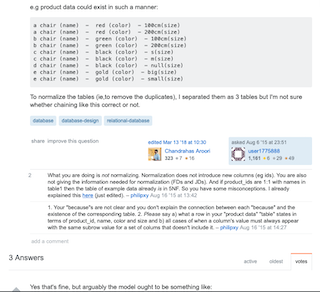

## Professional, Perfect, Pleasant Persona

Being a pleasant human being does not revolve around being an agreeable and conflict averse person; one could generate helpful conversation through healthy discourse. "...the kind of answers you get to your technical questions depends as much on the way you ask the questions as on the difficulty of developing the answer", this quote reveals to us that the quality of answers that a user receives is dependent on the quality of the question itself. (Raymond, "How To Ask, Questions The Smart Way") Therefore, it's imperative that aspiring professionals need to not only develop they're technical skill to answer questions, but their communication skills so to allow collaboration. This essay will further outline how one can achieve such a persona by taking a look at a great example and a not so great example provided by stackoverflow.

## Quality, Quintessential, Quick Query 
https://stackoverflow.com/questions/11227809/why-is-processing-a-sorted-array-faster-than-processing-an-unsorted-array

Stackoverflow makes it easy to sort through the best questions and answers through the concept of the upvote mecahnic. I chose one of the top voted not because of the unanimous positive reception, but also for its subject matter, phrasing and the helpfulness of the given answer. The question is simple "Why is processessing a sorted array faster than processing an unsorted array", to start off it just sounds like a curious programmer asking about the deep implementation of processing arrays. The way this person composed his/her body is pleasing to the eye due to formatting, areas focused into code, and explanation and insight underneath said code. 

This plays well into Mr. Raymond's many qualities of how to ask smart questions such as: Describing the goal (Done through explanation of what he has thought of so far), being explicit (reiterated at the end of the post), and most importantly the subject header/title implies an informed and curious developer. Since it has demonstrated many characteristics of a smart question it is no wonder that it has garnered interesting and intelligent responses. The top answer in particular sticks out due to its use of explaining a term that a fledgling developer will encounter which is Branch Prediction Fail. The way the responder attributed such a fail to this particular question was enjoyable and easy to read. Such is what a perfect answer will attract.  

## Imperfect, Inane, Inelegent Inqueries 
https://stackoverflow.com/questions/31867604/database-normalization-chaining

Similar to sorting through the best questions there is also a way to filter out the questions that is not as beneficial. 
The particular stackoverflow question I chose does not seem bad from first glance; Although, the title is not posed as a question and the inquery was saved until the end. What was asked is, does their method of chaining databases together follow the official paradigm. Some responces were that their implementation was fine while others questioned his methodology.  

A point of contention is the posted code does not actually meet the developers desired implementation. As such, it would seem like the poster has another problem besides wondering if their chaining structure is correct. Furthermore the responder that agreed that their chaining is correct brought up a different solution without going further as to why such a solution should be regarded. Interestingly, a responder recognized that this was a duplicate post from the same user and as such linked to a previous answer. Finally, it seems like some responders are not knowledgeable enough to attempt to answer because some definitions are even being argued over in replies. 

## Personal Growth

One could achieve many things with how they phrase their question. It's highly regarded in the workplace to always ask questions, but these questions should not be mundane and googleable. The point of learning is to see where the concept alligns with application and such an event will only be sparked with smart discussion. Furthermore, the idea that there are no bad questions instilled on us ever since grade school still stands. It's just the complete opposite of a smart question is a question thats waiting to be rephrased. 
