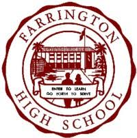
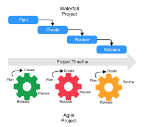
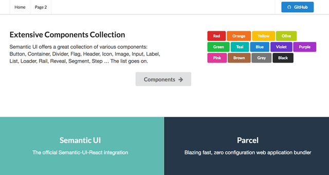

## Flexibility and Adaptability

My highschool's motto was "Enter to Learn, Go Forth to Serve" this sentiment seems so simple, but its important when its 
especially applied to the type of work that software engineers could get into. Even though it has heavy connotations with morality
and ethicality, I think it also easily applies to taking the generalized parts of software engineering into the real world. 
My software engineering class further developed the motto through managing the process of programming projects and developing
a sense of societal responsibility.  

## Agile 

The textbook definition of agile is, able to move efficiently and easily, as such it can be surmised that an agile process
prioritizes ease of use and fast development. The agile process was introduced to me when it came down to collaborating and
creating a final web application. Such a development process emphasized breaking down problems into small bite sized chunks
that allowed for each team member to effectively figure out which part of the project needs to be done. Therefore, communications
between the team is paramount to ensure that the direction is still clear and concise. This also meant that we needed an intimate
understanding of what the project was about because throwing in features left and right won't do any good since it might 
negatively affect another persons contribution. 

This process was definitely a layer of cake that I wholeheartedly swallowed partly because my experiences with working with teams.
There are some cases where I did most of the work and other times were the work was only done by others, that meant that there
was a flaw with how we understood the project. Moreover, this technique can be applicable not only to coding projects but any 
large scale projects itself. This is because its issue driven, where each task is dedicated to one member and each task seeks
to improve or optimize whats already been done. A great example is using this technique on my senior project, where me and my
team had to PCB design, debug and research about weatherboxes. Since a lot of the work could be done concurrently agile would have
worked perfectly. One person could have attended with creating the bill of materials for the parts that we needed, another could
debug the current boards, another could be testing the boards ability to gather meteorlogical data and so on. It's smooth, 
it's buttery, it's slick, it's all of the words that could describe a peak project. As such, entering this class taught me 
a managing technique that I'm sure will be put to good use again not only in my future classes but for other non-school related projects.

## Framed Work

One of the most satisfying things that have come out of learning how to create web applications is beautifying and modernizing
a page. HTML and CSS and a bit of JavaScript satiated my front-end wants, but with the introduction of Semantic UI and Semantic UI React meant that my pages were now presentable to family - not friends yet. 

## Fin

