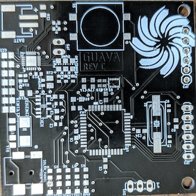

The state of Hawaii passed a law that promises that the entire state will be 100% renewable energy powered by the year 2045. In this way, students at UH manoa wanted to get ahead of this endeavor by promoting student ideas through the designing of weatherboxes. Weatherboxes are meant to gather metoerological data that will eventually get stored inside the labs database and be processed by another program. 

The team I was in was named Team Guava, a 5th generation team. The main idea of the Guava board was to get to a point where all the components would be integrated within the PCB itself. In this way, we could mass produce much more easily because we don't have to accomodate headers, pin traces related to multiple devices, become more affordable and take up less real estate. My involvement was mainly in the teams third Revision aptly dubbed as Revision C. Revision B before it was already designed, fabricated, populated and just needed testing and deployment on the roof at the start of Spring 2019 semester. My contribution was within the design of the Real Time Clock (RTC) which was a part inside the GPS chip that was used in Revision B. At first it was supposed to design the full GPS chip but the firmware team and the network hardware team informed us that for the time being we are foregoing GPS module. 

The embryo project woke me up to the thought of connecting code to the outside world, but the weatherbox project pried my eyes open. The lab contained people that I consider the most intelligent and affable people I've ever met. They introduced team dynamics that I forever will seek within my career, they thought me how to ask questions, how to research and how to speak to other professionals. I enjoyed it so much, I pursued this team as a part of my senior year project. 
