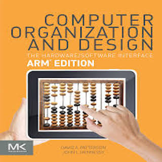

EE361 - labeled as Digital design - was a class based around learning smaller components that make up slightly larger components that make up a computer. In this way, we were building up to two architectural paradigms which are: single cycle and pipeline. This class focused on the Legv8 instruction set, which is a subset of the Armv8. Our final project was to replicate both a single-cycle and pipelined Leg Lite architecture. Lite in this case refers to how the parts were designed to only work in 32 bit, components were working in their most rudimentary forms and the instruction set was restricted to a few of the common ones like add, subtract, conditional jumps and branches. 

I designed the the single-cycle architecture, but my pipeline design was only able to recognize some commands such as: add and subtract. The single-cycle architecture's logic was to allow for one instruction to be fetched, processed and load into output registers. Pipelines logic is the same, but it allows for instructions to be followed one after another. An example of these two architecture logics, is doing laundry. In single-cycle you load the laundry, fold the laundry and put away that laundry one after the other. In pipeline, as soon as the laundry finishes at the machine, you load the next wash and have another person fetch the finished one to fold. As soon as the folding is done, another person will put it away and assuming the machine finishes at the same time you also load the the next one and so on. 

These final projects were such a great exercise on implementing all the components we will learned from the start. Going from how multiplexers worked, how registers stored and loaded memory, how adders added, etc. It was a fine example on how building small things first allows us to fully comprehend how the bigger picture trully operates. Also, if we didnt debug each module separetly, a whole world of looking at code for hours is waiting when the error messages pop up. 
